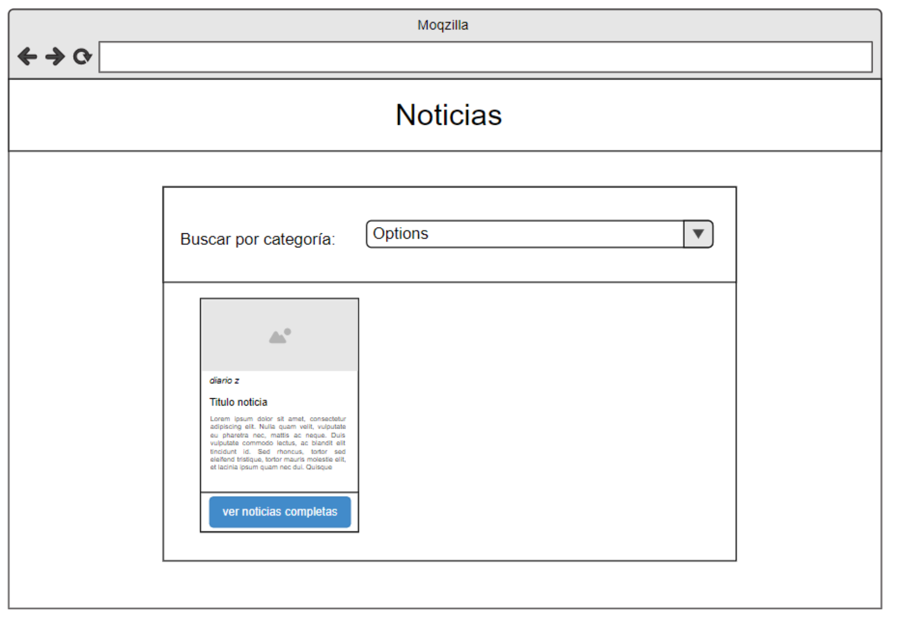

Ejercicio 11 y 12 Tp de react:

11 -Web de noticias - Dificultad:  🟢🟡
Crear una aplicación web con react, que consuma la API provista por https://newsapi.org/ o https://newsdata.io/docs , la aplicacion debe tener la siguiente estructura:

Componentes:
Título
Formulario (este contiene el select)
ListaNoticias
Noticia 

Desde el select superior, debe poder elegir las diferentes categorías (provistas por la api ver en la documentación) y cargar en cards las mismas.

NOTA: la api newsapi funciona solo en forma local y no en un proyecto de producción, si quieren deployar el proyecto en netlify usar newsdata
Web de noticias v2 - Dificultad:  🟢🟡

12 -Modifica la web anterior permitiendo que el usuario seleccione el país y la categoría de las noticias que quiere ver.

////////////////

NOTA:
pude hacer los 2 ejercicios juntos, solo que al final ultimando detalles me dio error al cambiar de categoria o pais. en la consola me aparece algo relacionado con ApiKey, intente solucionarlo pero no me dio tiempo.

Tambien quiza sea porque en consola me sale como si hubiera hecho demasiados requests a la API. espero sea eso.

Gracias y saludos!

